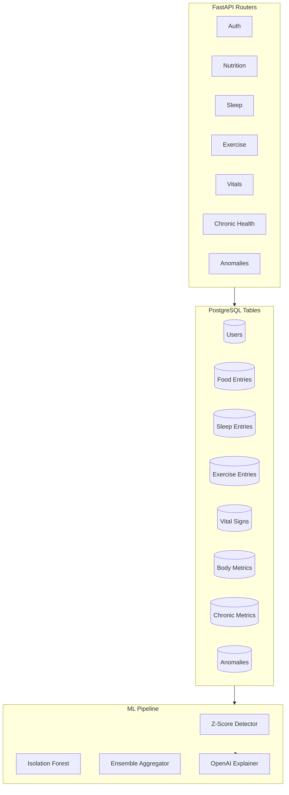

# VitalIQ Backend Implementation Plan (v2 - Expanded Metrics)

## Updated Architecture



## Expanded Database Models

### 1. User Model

```
users
├── id: UUID (PK)
├── email: String (unique)
├── hashed_password: String
├── name: String (optional)
├── date_of_birth: Date (optional, for age-based baselines)
├── created_at: Timestamp
└── updated_at: Timestamp
```

### 2. Food/Nutrition Entry

```
food_entries
├── id: UUID (PK)
├── user_id: UUID (FK -> users)
├── date: Date
├── meal_type: Enum (breakfast, lunch, dinner, snack)
├── food_name: String
├── calories: Float
├── protein_g: Float
├── carbs_g: Float
├── fats_g: Float
├── sugar_g: Float
├── fiber_g: Float (optional)
├── sodium_mg: Float (optional)
├── notes: Text (optional)
└── created_at: Timestamp
```

### 3. Sleep Entry

```
sleep_entries
├── id: UUID (PK)
├── user_id: UUID (FK -> users)
├── date: Date (the morning date)
├── bedtime: DateTime
├── wake_time: DateTime
├── duration_hours: Float (calculated)
├── quality_score: Integer (1-100)
├── deep_sleep_minutes: Integer (optional)
├── rem_sleep_minutes: Integer (optional)
├── awakenings: Integer (optional)
├── notes: Text (optional)
└── created_at: Timestamp
```

### 4. Exercise Entry

```
exercise_entries
├── id: UUID (PK)
├── user_id: UUID (FK -> users)
├── date: Date
├── exercise_type: Enum (cardio, strength, flexibility, sports, other)
├── exercise_name: String (e.g., "Running", "Bench Press", "Yoga")
├── duration_minutes: Integer
├── intensity: Enum (low, moderate, high, very_high)
├── calories_burned: Integer (optional)
├── heart_rate_avg: Integer (optional)
├── heart_rate_max: Integer (optional)
├── distance_km: Float (optional, for cardio)
├── sets: Integer (optional, for strength)
├── reps: Integer (optional, for strength)
├── weight_kg: Float (optional, for strength)
├── notes: Text (optional)
└── created_at: Timestamp
```

### 5. Vital Signs

```
vital_signs
├── id: UUID (PK)
├── user_id: UUID (FK -> users)
├── date: Date
├── time_of_day: Enum (morning, afternoon, evening, night)
├── resting_heart_rate: Integer (bpm)
├── hrv_ms: Integer (heart rate variability)
├── blood_pressure_systolic: Integer
├── blood_pressure_diastolic: Integer
├── respiratory_rate: Integer (breaths/min, optional)
├── body_temperature: Float (celsius, optional)
├── spo2: Integer (blood oxygen %, optional)
└── created_at: Timestamp
```

### 6. Body Metrics

```
body_metrics
├── id: UUID (PK)
├── user_id: UUID (FK -> users)
├── date: Date
├── weight_kg: Float
├── body_fat_pct: Float (optional)
├── muscle_mass_kg: Float (optional)
├── bmi: Float (calculated)
├── waist_cm: Float (optional)
├── notes: Text (optional)
└── created_at: Timestamp
```

### 7. Chronic Health Metrics

```
chronic_metrics
├── id: UUID (PK)
├── user_id: UUID (FK -> users)
├── date: Date
├── time_of_day: Enum (fasting, pre_meal, post_meal, bedtime, other)
├── condition_type: Enum (diabetes, hypertension, heart, other)
│
│  # Diabetes fields
├── blood_glucose_mgdl: Float (optional)
├── insulin_units: Float (optional)
├── hba1c_pct: Float (optional, quarterly)
│
│  # Heart/Cholesterol fields  
├── cholesterol_total: Float (optional)
├── cholesterol_ldl: Float (optional)
├── cholesterol_hdl: Float (optional)
├── triglycerides: Float (optional)
│
│  # General
├── medication_taken: String (optional)
├── symptoms: Text (optional)
├── notes: Text (optional)
└── created_at: Timestamp
```

### 8. Anomalies (Detection Results)

```
anomalies
├── id: UUID (PK)
├── user_id: UUID (FK -> users)
├── date: Date
├── source_table: String (which table the anomaly was detected in)
├── source_id: UUID (FK to the specific entry)
├── metric_name: String (e.g., "blood_glucose", "sleep_duration")
├── metric_value: Float
├── baseline_value: Float (user's typical value)
├── detector_type: Enum (zscore, isolation_forest, ensemble)
├── severity: Enum (low, medium, high)
├── anomaly_score: Float
├── explanation: Text (LLM-generated)
├── is_acknowledged: Boolean (default false)
└── detected_at: Timestamp
```

## Updated Project Structure

```
backend/
├── app/
│   ├── __init__.py
│   ├── main.py
│   ├── config.py
│   ├── database.py
│   │
│   ├── models/
│   │   ├── __init__.py
│   │   ├── user.py
│   │   ├── food_entry.py
│   │   ├── sleep_entry.py
│   │   ├── exercise_entry.py
│   │   ├── vital_signs.py
│   │   ├── body_metrics.py
│   │   ├── chronic_metrics.py
│   │   └── anomaly.py
│   │
│   ├── schemas/
│   │   ├── __init__.py
│   │   ├── auth.py
│   │   ├── food.py
│   │   ├── sleep.py
│   │   ├── exercise.py
│   │   ├── vitals.py
│   │   ├── body.py
│   │   ├── chronic.py
│   │   └── anomaly.py
│   │
│   ├── routers/
│   │   ├── __init__.py
│   │   ├── auth.py
│   │   ├── nutrition.py
│   │   ├── sleep.py
│   │   ├── exercise.py
│   │   ├── vitals.py
│   │   ├── body.py
│   │   ├── chronic.py
│   │   ├── anomalies.py
│   │   └── dashboard.py      # Aggregated view endpoint
│   │
│   ├── services/
│   │   ├── __init__.py
│   │   ├── auth_service.py
│   │   ├── metrics_service.py  # Unified metrics aggregation
│   │   ├── anomaly_service.py
│   │   └── insights_service.py
│   │
│   ├── ml/
│   │   ├── __init__.py
│   │   ├── feature_engineering.py  # Transform tables to feature matrix
│   │   ├── detectors/
│   │   │   ├── __init__.py
│   │   │   ├── base.py
│   │   │   ├── zscore.py
│   │   │   └── isolation_forest.py
│   │   └── ensemble.py
│   │
│   └── utils/
│       ├── __init__.py
│       ├── security.py
│       ├── mock_data.py
│       └── enums.py           # Shared enum definitions
│
├── alembic/
├── requirements.txt
├── alembic.ini
└── .env.example
```

## API Endpoints

### Authentication

| Method | Endpoint             | Description          |

| ------ | -------------------- | -------------------- |

| POST   | `/api/auth/register` | Register new user    |

| POST   | `/api/auth/login`    | Login, get JWT       |

| GET    | `/api/auth/me`       | Current user profile |

### Nutrition

| Method | Endpoint                       | Description                     |

| ------ | ------------------------------ | ------------------------------- |

| GET    | `/api/nutrition`               | List food entries (date filter) |

| POST   | `/api/nutrition`               | Log food entry                  |

| GET    | `/api/nutrition/daily-summary` | Daily macro totals              |

| DELETE | `/api/nutrition/{id}`          | Delete entry                    |

### Sleep

| Method | Endpoint           | Description        |

| ------ | ------------------ | ------------------ |

| GET    | `/api/sleep`       | List sleep entries |

| POST   | `/api/sleep`       | Log sleep entry    |

| GET    | `/api/sleep/stats` | Sleep statistics   |

### Exercise

| Method | Endpoint                       | Description             |

| ------ | ------------------------------ | ----------------------- |

| GET    | `/api/exercise`                | List exercise entries   |

| POST   | `/api/exercise`                | Log exercise            |

| GET    | `/api/exercise/weekly-summary` | Weekly activity summary |

### Vitals

| Method | Endpoint      | Description      |

| ------ | ------------- | ---------------- |

| GET    | `/api/vitals` | List vital signs |

| POST   | `/api/vitals` | Log vitals       |

### Body Metrics

| Method | Endpoint    | Description          |

| ------ | ----------- | -------------------- |

| GET    | `/api/body` | List body metrics    |

| POST   | `/api/body` | Log body measurement |

### Chronic Health

| Method | Endpoint              | Description               |

| ------ | --------------------- | ------------------------- |

| GET    | `/api/chronic`        | List chronic metrics      |

| POST   | `/api/chronic`        | Log chronic metric        |

| GET    | `/api/chronic/trends` | Condition-specific trends |

### Dashboard & Anomalies

| Method | Endpoint                          | Description               |

| ------ | --------------------------------- | ------------------------- |

| GET    | `/api/dashboard`                  | Unified daily/weekly view |

| GET    | `/api/anomalies`                  | List detected anomalies   |

| POST   | `/api/anomalies/detect`           | Trigger detection         |

| PATCH  | `/api/anomalies/{id}/acknowledge` | Mark as seen              |

| GET    | `/api/insights`                   | AI-generated insights     |

### Mock Data

| Method | Endpoint             | Description        |

| ------ | -------------------- | ------------------ |

| POST   | `/api/mock/generate` | Generate test data |

## Anomaly Detection - Feature Engineering

To run ML on separate tables, we need a feature engineering step:

```python
def build_daily_feature_matrix(user_id: UUID, days: int = 60) -> pd.DataFrame:
    """
    Aggregates all tables into a single feature matrix per day.
    
    Returns DataFrame with columns:
    - date
    - total_calories, total_protein, total_carbs, total_sugar
    - sleep_hours, sleep_quality
    - exercise_minutes, exercise_intensity_avg
    - resting_hr, hrv, bp_systolic, bp_diastolic
    - weight, body_fat_pct
    - blood_glucose_avg (if diabetic)
    - ... etc
    """
```

### Z-Score Detection Targets

| Metric         | Normal Range      | Flag Threshold            |

| -------------- | ----------------- | ------------------------- |

| Sleep duration | User's 30-day avg | ±2.5 std                  |

| Resting HR     | User's baseline   | ±2.5 std                  |

| Blood glucose  | 70-140 mg/dL      | Outside range or ±2.5 std |

| Daily calories | User's avg        | ±3.0 std (big swings)     |

| Blood pressure | 120/80 baseline   | ±2.5 std                  |

### Isolation Forest Features

```python
features = [
    'sleep_hours', 'sleep_quality',
    'total_calories', 'protein_ratio', 'sugar_intake',
    'exercise_minutes', 'exercise_intensity',
    'resting_hr', 'hrv', 'bp_systolic',
    'weight_change_7d',  # Derived: weight delta over 7 days
    'glucose_variability',  # Derived: std of daily readings
]
```

## Updated Time Estimate

| Task                            | Time           |

| ------------------------------- | -------------- |

| Project setup + config          | 20 min         |

| Database models (8 tables)      | 45 min         |

| Alembic migrations              | 15 min         |

| Auth module (JWT)               | 30 min         |

| CRUD for all metric types       | 60 min         |

| Mock data generator (all types) | 40 min         |

| Feature engineering pipeline    | 30 min         |

| Z-Score detector                | 30 min         |

| Isolation Forest detector       | 40 min         |

| Ensemble + OpenAI insights      | 40 min         |

| Dashboard aggregation endpoint  | 20 min         |

| Testing + polish                | 30 min         |

| **Total**                       | **~6.5 hours** |

This is more comprehensive but still leaves ~5.5 hours for frontend.